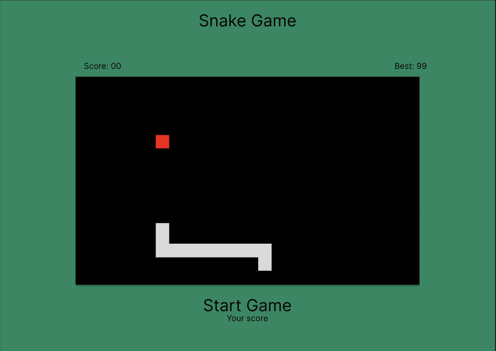
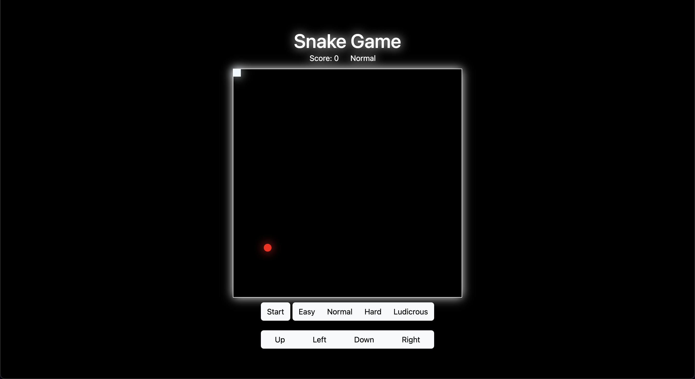

# Classic Snake Game

## Objective:
### - To recreate a version of the classic 8-bit snake game
---

## Find the game [here](https://classic-snake-game-ga.netlify.app/)

---

## Motivation:

### - I have always loved video games and one of the first games I can remember playing was snake on my dad's old Nokia cell phone. I loved the simple nature of the game and trying to beat my high score. Even now with all the advancements in graphics I still love the 8-bit style.

---
## Initial Ideas:

## Pseudocode:
1. Define the required variables for the game 
    - Board, snake, apple
2. Store cached element references 
   - Board, snake
3. Init function
   - Set board-size
   - Set snake
   - Generate food
4. Render the game
   - Update snake position?
5. Define the constants
   - boardState, snakeDirection	
6. Create arrow key functions
   - Loop until new input (either new direction or hit the edge of the board)
   - Set speed of looping?
7. Create “food” at a random spot   
   - function Math.floor(Math.random() * board size)
8. Create addToSnake function
   - Snake size plus 1
9. Create addToScore function
   - Score ++
10. Build gameOver function
    - If snake head === board edge or snake size === board size
11. If score > best push to best
    - Best = 0
    - If score is > best  best = score
12. Add CSS
    - Create a dark mode if there is time

---

## Live Game:

---

## Technology Implemented:

- Javascript
- Css
- Html
- Git
- Bootstrap

---

## Minimum Viable Product:

- As a user, I should be able to change the direction of the snake with the arrow keys.
- As a user, I should not be allowed to reverse my direction.
- As a user, my game should end when I hit a wall or a section of the snake.
- As a user, my score should go up each time I eat the apple.
- As a user, the snake should grow each time I eat an apple.
- As a user, I should be able to see what my score is.
- As a user, I should see my final score at the end of the game.

---

## Stretch Goals:

- ~~Change my difficulty setting~~ 
- Choose the size of your board
- Add a light/dark mode
- ~~Add background music~~
